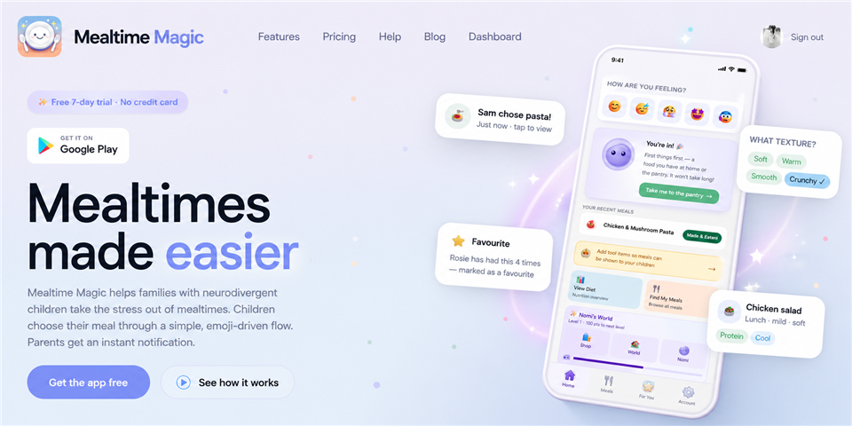
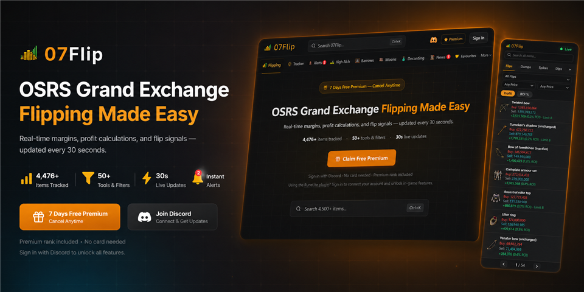
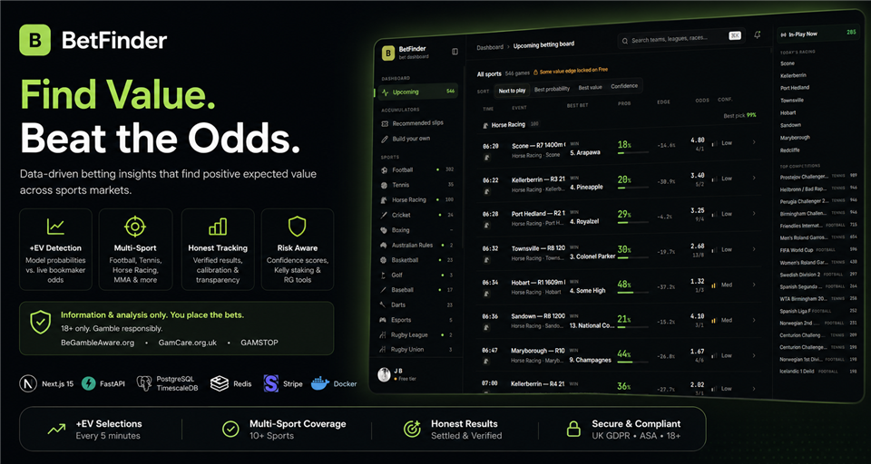
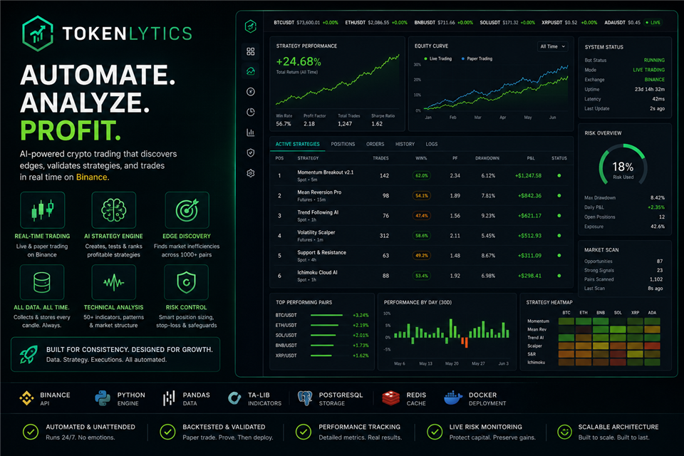
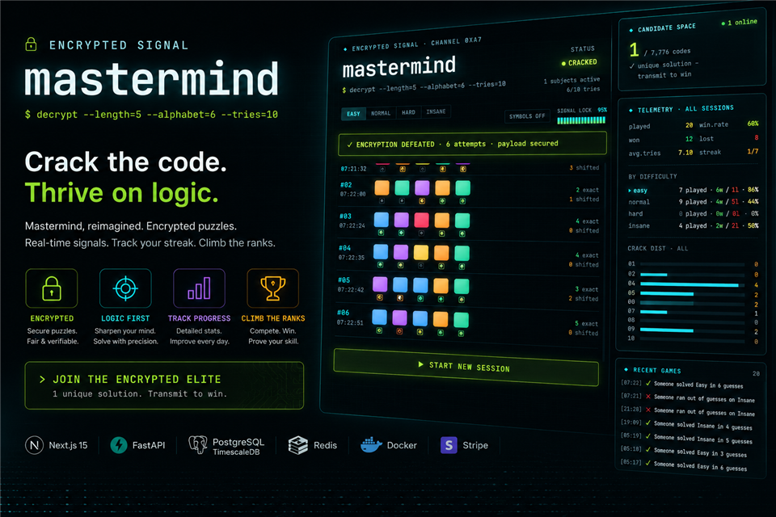
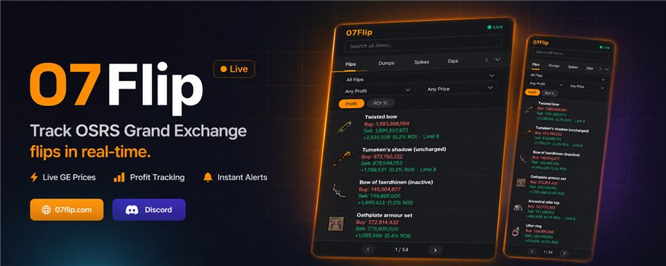
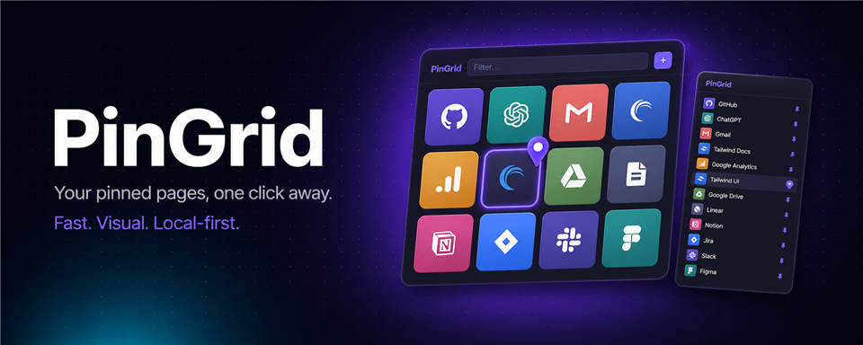

<!--
  UserD40 profile README — github_dark.
  Stats     : lowlighter/metrics  -> github-metrics.svg (header-only), committed to main.
  Activity  : Platane/snk snake    -> github-snake-dark.svg on the 'output' branch.
  Pitches   : committed fade-animation SVGs (assets/*-pitch.svg, brand-coloured).
  Tech grid : skill-icons + simple-icons.
  Optional  : add repo secret METRICS_TOKEN (classic PAT: repo, read:org, read:user)
              to fold private commit counts into the metrics header.
  TODO      : X / LinkedIn handles (commented out below); confirm product taglines.
-->

<!-- ===================== ANIMATED HEADER ===================== -->

<!-- ===================== INTRO BADGES ===================== -->

<!-- TODO: add handles, then uncomment:

-->

### Hi there 👋

I'm a solo founder and full-stack engineer running **JMHB LTD** ([jmhb.dev](https://jmhb.dev)). I architect, build and ship production software single-handedly, with **multiple full-stack products live in production** across gaming, fintech and consumer mobile. These days I build with large language models as much as I build software — 4+ years working with LLMs, including daily hands-on use of Claude and Claude Code — and I'm as interested in evaluating model output as generating it: prompt engineering, structured evals, judging against clear standards.

- 🚀 I deliver products end-to-end — product design, full-stack development, deployment and ongoing operations
- 🧠 Full-stack across web and mobile, with applied AI, automation and real-time data pipelines
- 🎓 BSc, plus a PGCE with **Qualified Teacher Status (QTS)** — years spent assessing work against standards and giving structured, criteria-based feedback
- 🛠️ TypeScript-first: **Next.js** & **React Native** on the front end, **Supabase / Postgres** on the back
- 📫 Open to interesting work — **contact@jmhb.dev**

<!-- stats (metrics, header-only) + flat animated activity snake -->

 

<!-- ===================== SHIPPED PRODUCTS ===================== -->

<b>🚀&nbsp; Shipped products</b>

 

Live products I've built and run — here's what each one does:

<!-- ===================== TECH STACK (one merged grid) ===================== -->
## 🧰 Tech stack

<table width="100%">
  <tr>
    <td align="center" width="15%"> TypeScript</td>
    <td align="center" width="15%"> JavaScript</td>
    <td align="center" width="15%"> Python</td>
    <td align="center" width="15%"> Java</td>
    <td align="center" width="15%"> React / RN</td>
    <td align="center" width="15%"> Next.js</td>
  </tr>
  <tr>
    <td align="center" width="15%"> Node.js</td>
    <td align="center" width="15%"> FastAPI</td>
    <td align="center" width="15%"> Expo</td>
    <td align="center" width="15%"> Tailwind</td>
    <td align="center" width="15%"> Supabase</td>
    <td align="center" width="15%"> Postgres</td>
  </tr>
  <tr>
    <td align="center" width="15%"> Prisma</td>
    <td align="center" width="15%"> Redis</td>
    <td align="center" width="15%"> SQLite</td>
    <td align="center" width="15%"> Firebase</td>
    <td align="center" width="15%"> Stripe</td>
    <td align="center" width="15%"> Docker</td>
  </tr>
  <tr>
    <td align="center" width="15%"> Cloudflare</td>
    <td align="center" width="15%"> Nginx</td>
    <td align="center" width="15%"> Gradle</td>
    <td align="center" width="15%"> Git</td>
    <td align="center" width="15%"> GitHub</td>
    <td align="center" width="15%"></td>
  </tr>
</table>

 

<!-- ===================== FOOTER ===================== -->

  
<i>Everything I'm building can be found at — <a href="https://jmhb.dev">jmhb.dev</a></i>

